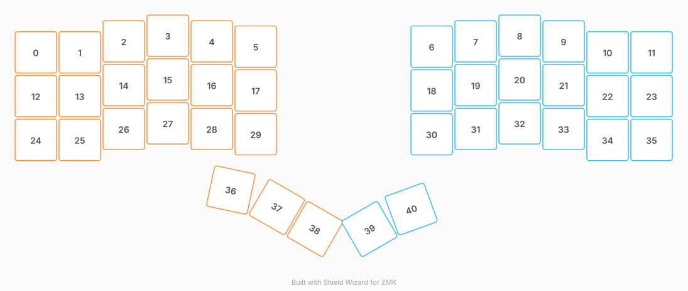

# ZMK Configuration for charybdis_mini

*Generated by Shield Wizard for ZMK*



Download compiled firmware from the Actions tab. <https://zmk.dev/docs/user-setup#installing-the-firmware>

Edit your keymap <https://zmk.dev/docs/keymaps>.
User keymap is located at [`config/charybdis_mini.keymap`](config/charybdis_mini.keymap).

-----

<details>
<summary>
Shield Wizard Debug Information
</summary>

In case of broken configuration, here is the Shield Wizard internal data used to generate this configuration:

Commit: ab99418c376887d043556e4a1af5a8d1c78d686c

```json
{"name":"charybdis_mini","shield":"charybdis_mini","dongle":false,"modules":["badjeff/pmw3610"],"layout":[{"id":"01M0R13QC9WFB4XD409D12EVFC","part":0,"row":0,"col":0,"w":1,"h":1,"x":0,"y":0.38,"r":0,"rx":0,"ry":0},{"id":"01M0R13QC957KEB8GZ21ZS3F3N","part":0,"row":0,"col":1,"w":1,"h":1,"x":1,"y":0.38,"r":0,"rx":0,"ry":0},{"id":"01M0R13QC9MM77M2AEEK270Q43","part":0,"row":0,"col":2,"w":1,"h":1,"x":2,"y":0.13,"r":0,"rx":0,"ry":0},{"id":"01M0R13QC9MP3QJQCK5VH1X3R2","part":0,"row":0,"col":3,"w":1,"h":1,"x":3,"y":0,"r":0,"rx":0,"ry":0},{"id":"01M0R13QC92WB3HV16T4X23X2Y","part":0,"row":0,"col":4,"w":1,"h":1,"x":4,"y":0.13,"r":0,"rx":0,"ry":0},{"id":"01M0R13QC9W53F6AKF5Y0FH428","part":0,"row":0,"col":5,"w":1,"h":1,"x":5,"y":0.25,"r":0,"rx":0,"ry":0},{"id":"01M0R13QC9DM3K73NSC37WHZ6P","part":1,"row":0,"col":6,"w":1,"h":1,"x":9,"y":0.25,"r":0,"rx":0,"ry":0},{"id":"01M0R13QC958AGN54CAWWHYRKC","part":1,"row":0,"col":7,"w":1,"h":1,"x":10,"y":0.13,"r":0,"rx":0,"ry":0},{"id":"01M0R13QC9QCKV9XG7WFKS5NZZ","part":1,"row":0,"col":8,"w":1,"h":1,"x":11,"y":0,"r":0,"rx":0,"ry":0},{"id":"01M0R13QC9D4XDQHSJ1KD8ES3A","part":1,"row":0,"col":9,"w":1,"h":1,"x":12,"y":0.13,"r":0,"rx":0,"ry":0},{"id":"01M0R13QC9KWT4D354Y7T1ARBC","part":1,"row":0,"col":10,"w":1,"h":1,"x":13,"y":0.38,"r":0,"rx":0,"ry":0},{"id":"01M0R13QC97CTRMJ47G430ZC6K","part":1,"row":0,"col":11,"w":1,"h":1,"x":14,"y":0.38,"r":0,"rx":0,"ry":0},{"id":"01M0R13QC9A4XTX1BMT3SXS165","part":0,"row":1,"col":0,"w":1,"h":1,"x":0,"y":1.38,"r":0,"rx":0,"ry":0},{"id":"01M0R13QC9Y6J19EF7Z3GABGJF","part":0,"row":1,"col":1,"w":1,"h":1,"x":1,"y":1.38,"r":0,"rx":0,"ry":0},{"id":"01M0R13QC97SCRFSK8RYZGXRC3","part":0,"row":1,"col":2,"w":1,"h":1,"x":2,"y":1.13,"r":0,"rx":0,"ry":0},{"id":"01M0R13QC9DMP0E6N69MX5K7XY","part":0,"row":1,"col":3,"w":1,"h":1,"x":3,"y":1,"r":0,"rx":0,"ry":0},{"id":"01M0R13QC984HKXQVRAMZRJYVG","part":0,"row":1,"col":4,"w":1,"h":1,"x":4,"y":1.13,"r":0,"rx":0,"ry":0},{"id":"01M0R13QC9WX6FSWY8M7RXZ4H6","part":0,"row":1,"col":5,"w":1,"h":1,"x":5,"y":1.25,"r":0,"rx":0,"ry":0},{"id":"01M0R13QC9V343RF8YB80QND4Z","part":1,"row":1,"col":6,"w":1,"h":1,"x":9,"y":1.25,"r":0,"rx":0,"ry":0},{"id":"01M0R13QC93NXBSMZSHBSY7ECC","part":1,"row":1,"col":7,"w":1,"h":1,"x":10,"y":1.13,"r":0,"rx":0,"ry":0},{"id":"01M0R13QC94S4QE4EKY4CZ9N2K","part":1,"row":1,"col":8,"w":1,"h":1,"x":11,"y":1,"r":0,"rx":0,"ry":0},{"id":"01M0R13QC9E8794RB6KMNYK95G","part":1,"row":1,"col":9,"w":1,"h":1,"x":12,"y":1.13,"r":0,"rx":0,"ry":0},{"id":"01M0R13QC99XRJ16WFT9450RMM","part":1,"row":1,"col":10,"w":1,"h":1,"x":13,"y":1.38,"r":0,"rx":0,"ry":0},{"id":"01M0R13QC93E4NVCYRW9PDZW30","part":1,"row":1,"col":11,"w":1,"h":1,"x":14,"y":1.38,"r":0,"rx":0,"ry":0},{"id":"01M0R13QC9J7HHT62VAN3SNVX6","part":0,"row":2,"col":0,"w":1,"h":1,"x":0,"y":2.38,"r":0,"rx":0,"ry":0},{"id":"01M0R13QC9AJTYN7SJWTQZ4MG0","part":0,"row":2,"col":1,"w":1,"h":1,"x":1,"y":2.38,"r":0,"rx":0,"ry":0},{"id":"01M0R13QC9M4V0RTERB11EZ19M","part":0,"row":2,"col":2,"w":1,"h":1,"x":2,"y":2.13,"r":0,"rx":0,"ry":0},{"id":"01M0R13QC9C834TEFNFDGTB6QB","part":0,"row":2,"col":3,"w":1,"h":1,"x":3,"y":2,"r":0,"rx":0,"ry":0},{"id":"01M0R13QC9QY3QM5DNB24SC2GK","part":0,"row":2,"col":4,"w":1,"h":1,"x":4,"y":2.13,"r":0,"rx":0,"ry":0},{"id":"01M0R13QC981G8AWSH6BAB50TK","part":0,"row":2,"col":5,"w":1,"h":1,"x":5,"y":2.25,"r":0,"rx":0,"ry":0},{"id":"01M0R13QC969AQGM7TVVD9KQYE","part":1,"row":2,"col":6,"w":1,"h":1,"x":9,"y":2.25,"r":0,"rx":0,"ry":0},{"id":"01M0R13QC9G63SX5M6JZ66YKT4","part":1,"row":2,"col":7,"w":1,"h":1,"x":10,"y":2.13,"r":0,"rx":0,"ry":0},{"id":"01M0R13QC92AP1ZFDNS74C4DSZ","part":1,"row":2,"col":8,"w":1,"h":1,"x":11,"y":2,"r":0,"rx":0,"ry":0},{"id":"01M0R13QC9M5RG6K8NV0RWH7BB","part":1,"row":2,"col":9,"w":1,"h":1,"x":12,"y":2.13,"r":0,"rx":0,"ry":0},{"id":"01M0R13QC9G8R2V8N1ZEVSTXJC","part":1,"row":2,"col":10,"w":1,"h":1,"x":13,"y":2.38,"r":0,"rx":0,"ry":0},{"id":"01M0R13QC95BQP7VDP3CRDRV8Y","part":1,"row":2,"col":11,"w":1,"h":1,"x":14,"y":2.38,"r":0,"rx":0,"ry":0},{"id":"01M0R13QC9A37XE6YV8M7Q9R38","part":0,"row":4,"col":3,"w":1,"h":1,"x":4.55,"y":3.4299999999999997,"r":12,"rx":0,"ry":0},{"id":"01M0R13QC97EG5X2WSBM1112HD","part":0,"row":4,"col":4,"w":1,"h":1,"x":3.98,"y":3.7800000000000002,"r":30,"rx":4.98,"ry":7.15},{"id":"01M0R13QC9FT80A0YANBBV86FR","part":0,"row":4,"col":5,"w":1,"h":1,"x":4.98,"y":3.7800000000000002,"r":30,"rx":0,"ry":7.15},{"id":"01M0R13QC9ECNNFZ6SWZF58JRZ","part":1,"row":4,"col":6,"w":1,"h":1,"x":9.02,"y":4.03,"r":-30,"rx":9.52,"ry":7.4},{"id":"01M0R13QC907BQRWEBA6XDHFKF","part":1,"row":4,"col":7,"w":1,"h":1,"x":9.57,"y":3.9699999999999998,"r":-20,"rx":9.52,"ry":7.4}],"parts":[{"name":"left","controller":"nice_nano@2//zmk","pins":{"d8":{"usage":"kscan","kscan":"01M0R350MWPKYXX9B2HGPVRJ9A","role":"input"},"d7":{"usage":"kscan","kscan":"01M0R350MWPKYXX9B2HGPVRJ9A","role":"input"},"d6":{"usage":"kscan","kscan":"01M0R350MWPKYXX9B2HGPVRJ9A","role":"input"},"d10":{"usage":"kscan","kscan":"01M0R350MWPKYXX9B2HGPVRJ9A","role":"input"},"d20":{"usage":"kscan","kscan":"01M0R350MWPKYXX9B2HGPVRJ9A","role":"input"},"d19":{"usage":"kscan","kscan":"01M0R350MWPKYXX9B2HGPVRJ9A","role":"input"},"d21":{"usage":"kscan","kscan":"01M0R350MWPKYXX9B2HGPVRJ9A","role":"output"},"d18":{"usage":"kscan","kscan":"01M0R350MWPKYXX9B2HGPVRJ9A","role":"output"},"d5":{"usage":"kscan","kscan":"01M0R350MWPKYXX9B2HGPVRJ9A","role":"output"},"d4":{"usage":"kscan","kscan":"01M0R350MWPKYXX9B2HGPVRJ9A","role":"output"}},"kscans":[{"kind":"matrix","id":"01M0R350MWPKYXX9B2HGPVRJ9A","diodes":true}],"keys":{"01M0R13QC9WFB4XD409D12EVFC":{"input":"d8","output":"d21"},"01M0R13QC957KEB8GZ21ZS3F3N":{"input":"d7","output":"d21"},"01M0R13QC9MM77M2AEEK270Q43":{"input":"d6","output":"d21"},"01M0R13QC9MP3QJQCK5VH1X3R2":{"input":"d10","output":"d21"},"01M0R13QC92WB3HV16T4X23X2Y":{"input":"d20","output":"d21"},"01M0R13QC9W53F6AKF5Y0FH428":{"input":"d19","output":"d21"},"01M0R13QC9FT80A0YANBBV86FR":{"input":"d19","output":"d4"},"01M0R13QC9A4XTX1BMT3SXS165":{"input":"d8","output":"d18"},"01M0R13QC9J7HHT62VAN3SNVX6":{"input":"d8","output":"d5"},"01M0R13QC9Y6J19EF7Z3GABGJF":{"input":"d7","output":"d18"},"01M0R13QC97SCRFSK8RYZGXRC3":{"input":"d6","output":"d18"},"01M0R13QC9M4V0RTERB11EZ19M":{"input":"d6","output":"d5"},"01M0R13QC9AJTYN7SJWTQZ4MG0":{"input":"d7","output":"d5"},"01M0R13QC9DMP0E6N69MX5K7XY":{"input":"d10","output":"d18"},"01M0R13QC9C834TEFNFDGTB6QB":{"input":"d10","output":"d5"},"01M0R13QC984HKXQVRAMZRJYVG":{"input":"d20","output":"d18"},"01M0R13QC9QY3QM5DNB24SC2GK":{"input":"d20","output":"d5"},"01M0R13QC97EG5X2WSBM1112HD":{"input":"d20","output":"d4"},"01M0R13QC9A37XE6YV8M7Q9R38":{"input":"d10","output":"d4"},"01M0R13QC9WX6FSWY8M7RXZ4H6":{"input":"d19","output":"d18"},"01M0R13QC981G8AWSH6BAB50TK":{"input":"d19","output":"d5"}},"encoders":[],"buses":{}},{"name":"right","controller":"nice_nano@2//zmk","pins":{"d10":{"usage":"kscan","kscan":"01M0R4DQWJQJCYM4QR80QYCAN1","role":"input"},"d20":{"usage":"kscan","kscan":"01M0R4DQWJQJCYM4QR80QYCAN1","role":"input"},"d19":{"usage":"kscan","kscan":"01M0R4DQWJQJCYM4QR80QYCAN1","role":"input"},"d8":{"usage":"kscan","kscan":"01M0R4DQWJQJCYM4QR80QYCAN1","role":"input"},"d7":{"usage":"kscan","kscan":"01M0R4DQWJQJCYM4QR80QYCAN1","role":"input"},"d6":{"usage":"kscan","kscan":"01M0R4DQWJQJCYM4QR80QYCAN1","role":"input"},"d21":{"usage":"kscan","kscan":"01M0R4DQWJQJCYM4QR80QYCAN1","role":"output"},"d18":{"usage":"kscan","kscan":"01M0R4DQWJQJCYM4QR80QYCAN1","role":"output"},"d5":{"usage":"kscan","kscan":"01M0R4DQWJQJCYM4QR80QYCAN1","role":"output"},"d4":{"usage":"kscan","kscan":"01M0R4DQWJQJCYM4QR80QYCAN1","role":"output"}},"kscans":[{"kind":"matrix","id":"01M0R4DQWJQJCYM4QR80QYCAN1","diodes":true}],"keys":{"01M0R13QC9DM3K73NSC37WHZ6P":{"input":"d10","output":"d21"},"01M0R13QC9V343RF8YB80QND4Z":{"input":"d10","output":"d18"},"01M0R13QC969AQGM7TVVD9KQYE":{"input":"d10","output":"d5"},"01M0R13QC958AGN54CAWWHYRKC":{"input":"d20","output":"d21"},"01M0R13QC93NXBSMZSHBSY7ECC":{"input":"d20","output":"d18"},"01M0R13QC9G63SX5M6JZ66YKT4":{"input":"d20","output":"d5"},"01M0R13QC9QCKV9XG7WFKS5NZZ":{"input":"d19","output":"d21"},"01M0R13QC94S4QE4EKY4CZ9N2K":{"input":"d19","output":"d18"},"01M0R13QC92AP1ZFDNS74C4DSZ":{"input":"d19","output":"d5"},"01M0R13QC9D4XDQHSJ1KD8ES3A":{"input":"d8","output":"d21"},"01M0R13QC9E8794RB6KMNYK95G":{"input":"d8","output":"d18"},"01M0R13QC9M5RG6K8NV0RWH7BB":{"input":"d8","output":"d5"},"01M0R13QC9KWT4D354Y7T1ARBC":{"input":"d7","output":"d21"},"01M0R13QC99XRJ16WFT9450RMM":{"input":"d7","output":"d18"},"01M0R13QC9G8R2V8N1ZEVSTXJC":{"input":"d7","output":"d5"},"01M0R13QC97CTRMJ47G430ZC6K":{"input":"d6","output":"d21"},"01M0R13QC93E4NVCYRW9PDZW30":{"input":"d6","output":"d18"},"01M0R13QC95BQP7VDP3CRDRV8Y":{"input":"d6","output":"d5"},"01M0R13QC9ECNNFZ6SWZF58JRZ":{"input":"d10","output":"d4"},"01M0R13QC907BQRWEBA6XDHFKF":{"input":"d20","output":"d4"}},"encoders":[],"buses":{}}]}
```

</details>


	// 	         ____
	//  	 _____|    |____
	//  	 |o            o|
	// 1	 |o            o|
	// 0	 |o            o|
	//  	 |o            o|
	//  	 |o            o|
	// 2	 |o            o|  21
	// 3	 |o            o|  20 
	// 4	 |o            o|  19 
	// 5	 |o            o|  18
	// 6	 |o            o|  15
	// 7	 |o            o|  14
	// 8	 |o            o|  16
	// 9	 |o            o|  10 


PMW3610 Pin 	nRF52840 Pin 	Description
SDIO 	P1.00 	SPI MOSI/MISO (bidirectional data line)
SCLK 	P0.24 	SPI clock signal
NCS 	P0.22 	Chip select (active low)
MOT 	P0.20 	Motion interrupt pin (active low, pull-up)
GND 	GND 	Ground
VDD 	VCC 	Power supply (3.3V)
